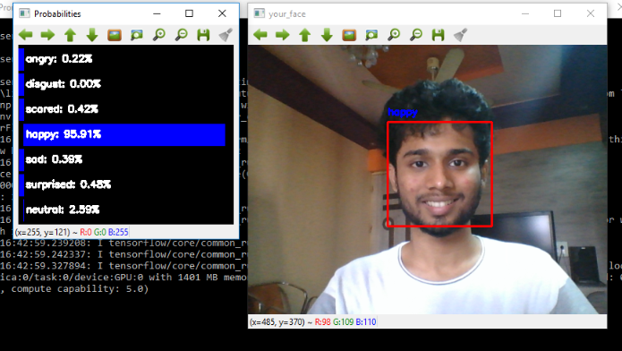

# Emotion_mining_cnn
Facial emotion recognition in real time using keras and Opencv.

# Requirements
The code is written in python 
Keras 
cv2 
Numpy 
Pandas

#  Data
The data set consists of grayscale images which are 48 x 48 as dimension and the label consists of 7 expressions. 
Download the data set from https://www.kaggle.com/c/challenges-in-representation-learning-facial-expression-recognition-challenge and place it inside fer2013 folder.

# Running the model
Have already included a trained model. 
To simply run the model, use the script real_time_video.py

# Example

# Training
To train the model by yourself, run train_cnn.py
